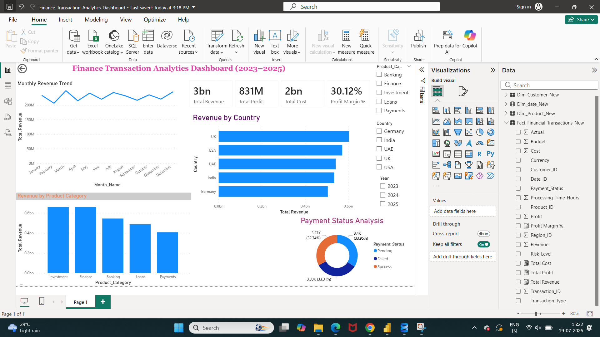

# Finance Data Analytics Project

## 📌 Project Overview

This project focuses on analyzing financial transaction data to generate meaningful business insights using SQL Server and Power BI.

The objective of this project is to transform raw financial data into actionable insights by analyzing revenue, profit, payment status, product performance, and country-wise trends.

---

## 📸 Dashboard Preview

  

---  

## 🏢 Business Problem

Financial organizations handle large volumes of transaction data. The challenge is to analyze this data effectively and provide insights that support business decision-making.

This project helps answer:

* What is the overall revenue and profit performance?
* Which product categories generate the highest revenue?
* Which countries contribute the most revenue?
* What is the payment success and failure trend?
* How does revenue change over time?

---

## 🛠️ Tools & Technologies Used

* **SQL Server** – Data storage, querying, and analysis
* **Power BI** – Interactive dashboard creation and visualization
* **DAX** – Measures and calculated insights
* **Excel / CSV** – Data preparation and import

---

## 📂 Project Structure

```
Finance-Data-Analytics-Project
│
├── Fact_Financial_Transactions_New.csv
│
├── SQL_Scripts.sql
│
├── PowerBI-Dashboard
│   └── Finance_Transaction_Analytics_Dashboard.pbix
│
├── Dashboard_Screenshot.png
│
└── README.md
``` 

---

## 📊 Dataset Description

Dataset Name:

**Fact_Financial_Transactions_New**

The dataset contains financial transaction details such as:

* Transaction Date
* Product Category
* Country
* Revenue
* Cost
* Profit
* Payment Status

---

## 🔄 Data Analysis Process

1. Imported financial transaction data into SQL Server
2. Performed data validation and analysis using SQL queries
3. Created KPIs and DAX measures in Power BI
4. Built interactive dashboard visuals
5. Generated business insights from financial trends

--- 

## 📊 Finance Transaction Analytics Dashboard (2023–2025)

This Power BI dashboard provides interactive analysis of financial transactions from 2023 to 2025.

Key analysis includes:
- Monthly Revenue Trend
- Revenue by Product Category
- Country-wise Revenue Analysis
- Payment Status Analysis
- Profit and Revenue Performance

### 1. Monthly Revenue Trend

* Analyzes revenue growth pattern over time
* Helps identify monthly performance trends

### 2. Revenue by Product Category

* Compares revenue contribution from different categories
* Identifies top-performing products

### 3. Revenue by Country

* Shows country-wise revenue performance
* Highlights high-value regions

### 4. Payment Status Analysis

* Analyzes successful and failed transactions
* Helps understand payment performance

---

## 🔑 Key Business Insights

* Analyzed overall revenue and profitability trends
* Identified highest revenue-generating product categories
* Compared country-wise financial performance
* Evaluated payment status distribution
* Created an interactive dashboard for business users

---

## 🧩 Skills Demonstrated

- SQL Querying
- Data Cleaning
- Data Analysis
- Power BI Dashboard Development
- DAX Measures
- Financial Reporting
- Business Intelligence

---

## 👩‍💻 Author

**Rupali Mane**

Finance Analyst | Data Analytics Enthusiast

### Technical Skills

SQL | Power BI | DAX | Data Visualization | Financial Analytics

